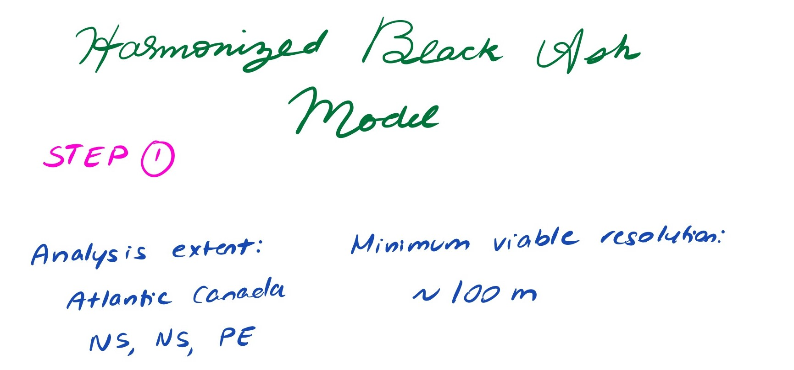
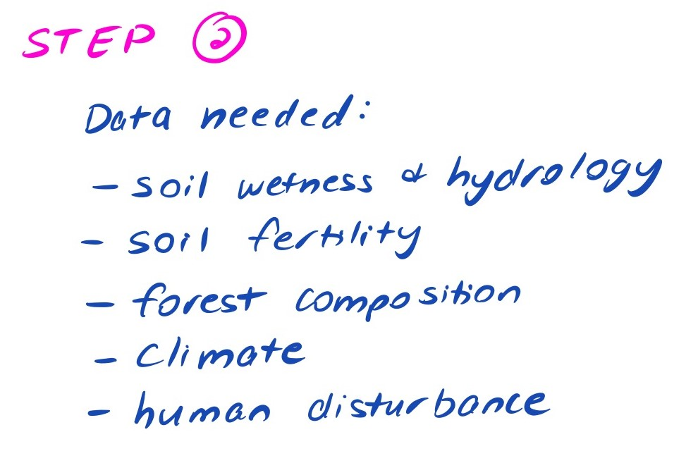
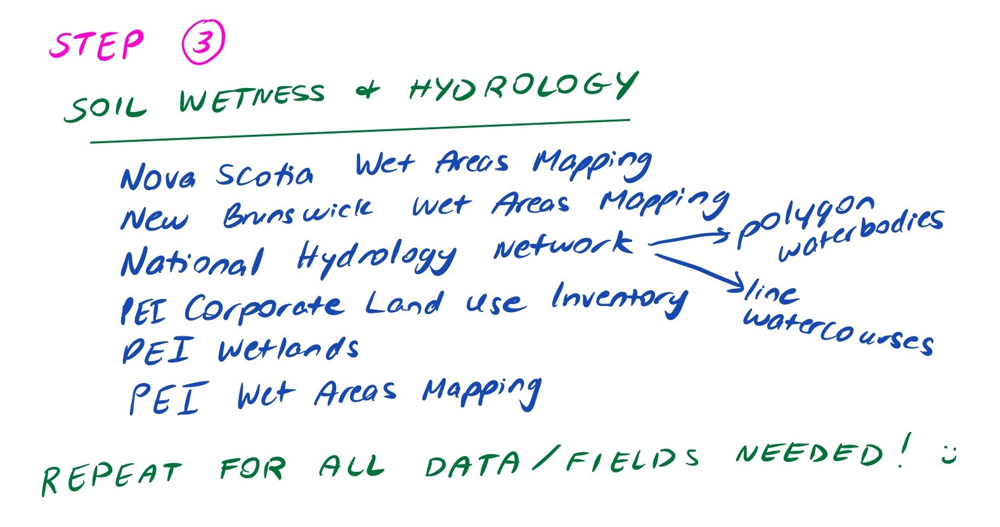
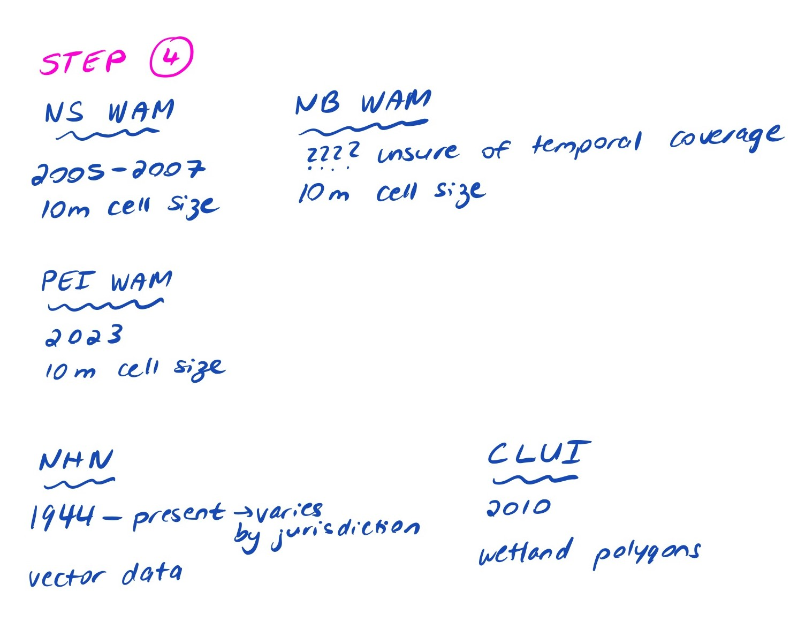
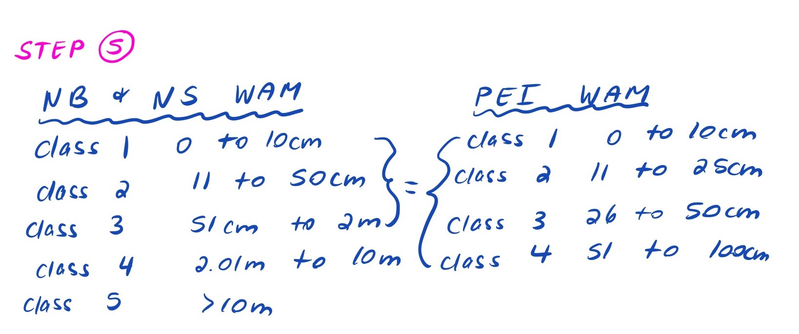
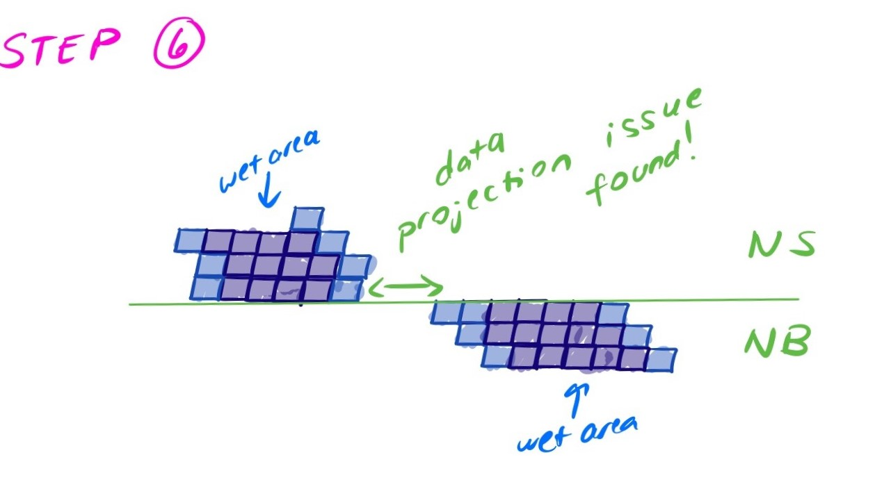

By: [Jocelyn Pender]({{ 'best-practices-wg-team/#Jocelyn+Pender' | relative_url }}), [Robert Buchkowski]({{ 'best-practices-wg-team/#Dr.+Robert+Buchkowski' | relative_url }}), [Courtney Burk]({{ 'best-practices-wg-team/#Courtney+Burk' | relative_url }}), Riley Scanlan, Miranda Frison, Geneva Bahen, Firas

### Step One: Should You Harmonize Datasets

A preliminary step should precede dataset harmonization: outline (1) the extent of your analysis and (2) the minimum viable resolution of your analysis. This will tell you whether you can or should proceed to dataset harmonization. For instance, if datasets from a certain jurisdiction do not meet the minimum viable resolution, you should not proceed to harmonize. Alternatively, if the species you wish to model occupies a tiny portion of one jurisdiction, it may not be worthwhile to harmonize (i.e., how much of the jurisdiction does the species actually occupy).

{:.col-md-8 .mx-auto}
_An example of step one implementation_

### Step Two: Identify the Data You Need

Identify the datasets and/or fields that you will need. Start with a method-independent approach: develop field descriptions that are method independent (i.e., “some measure of non-forested habitat”). 

{:.col-md-6 .mx-auto} 
_An example of step two implementation_

### Step Three: Find All Data Streams

Next, look for those data across multiple data sets. Start with the data set that you know best, but use your method independent description to find all the possible data streams.

Many times there will be multiple options (i.e., do you assign forest type from LiDAR or photo-interpreted images). All options should be tried and evaluated based on their cross-data source agreement or ability to predict dependent variables. Remember to consider whether the dataset is measuring what you believe or need it to be measuring!

{:.col-md-8 .mx-auto} 
_An example of step three implementation_

### Step Four: Collect Dataset Metadata

Consider the temporal coverage and spatial resolution of your component datasets, and whether field values are compatible (e.g., units of measurement used for numerical data, semantics of field values for categorical data).

{:.col-md-8 .mx-auto} 
_An example of step four implementation_

### Step Five: Field Mapping

Proposed workflow:
1. Start with the dataset you know best. 
2. Determine what fields you need.
3. Begin field mapping with additional datasets. 
* Select a second dataset. 
* Examine the fields. Select fields that you think might align with your existing dataset. 
* Seek to understand these fields and filter to the ones that best fit your first data set.
* Make logical and justifiable links between the fields of the two datasets. 
* Next, look closely at the values of the field and decide whether or not you need to combine values or keep them distinct. Do the semantics of field values align? Are the units of measurement comparable?
* Continue for each additional dataset.

{:.col-md-8 .mx-auto}
_An example of step five implementation_ 

### Step Six: Validate Your Harmonization

Validating the merger of two data sources should be done by checking logical relationships between the data. For example, are LiDAR estimates of forest basal area near zero where the land use polygons have fields or waterways? Do land use types along provincial boundaries line up sensibly (i.e., a forest stand spanning the NB and NS doesn't have unreasonable composition changes)? Do watercourses, water bodies and wet areas align (vertices along jurisdictional boundaries) or are they displaced?

{:.col-md-8 .mx-auto} 
_An example of step six implementation_

### Step Seven: Document Your Work

To ensure transparency and reproducibility of your data harmonization workflow, consider making a field mapping table available in your project report that describes any transformations performed on the component datasets (e.g., field value aggregations).

