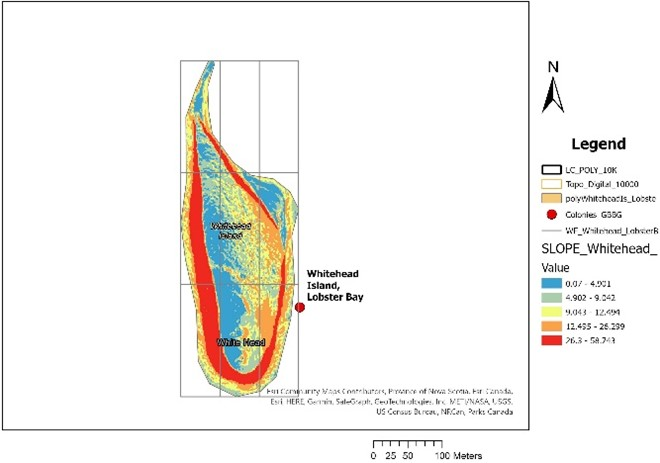
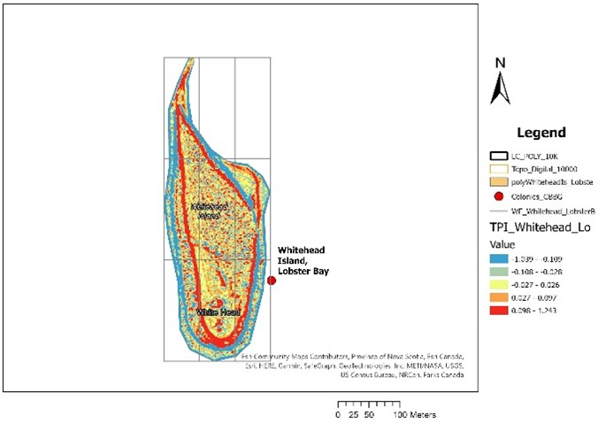

## When/How to Use Topographic Position Index (TPI) as a Habitat Covariate

By: [David Lieske]({{ 'best-practices-wg-team/#Dr.+David+Lieske' | relative_url }})

### Interpreting Topography
* The objective with this is to ascertain where the “high” and “low” points are in the landscape (assuming there are any and they aren’t just a flat, low elevation, flood-prone slab).
* A promising measure is the topographic position index (TPI), which is a neighbourhood-based statistic for assessing relative position:

$$TPI = int((dem-focalmean(dem,annulus,irad,orad))+0.5)^1$$

Positive TPI values indicate “top” of topographic gradients, and negative TPI values indicate “bottom” of topographic gradients.

Notice that the previous is an integer-rounded formula. Wilson et al. (2007) provide a non-integer-rounded analog for bathymetric position calculations:

$$BPI=Z_{grid}-focalmean(Z_{grid},circle,r)$$

An alternative relative TPI measure (scaled [0,1]) is provided by Bale et al. (2020):

$$TPI={(DEM_{mean}-DEM_{min})\over(DEM_{MAX}-DEM_{MIN})}$$

The previous was applied in ArcGIS using the focal statistics tool for an area of 420 m2 (radius ~ 11.6m). 

#### Q. what’s better: annulus (donut-shaped) neighbourhood (as in the first formula), or as a circle (as in the second formula)? (below from ESRI documentation)

{: .rounded .float-center}
A processing cell with the default annulus neighborhood (inner radius = 1 cell, outer radius = 3 cells).

#### Q. what are appropriate definitions of the inner and outer radii (irad and orad, respectively) in the case of the first formula? What about for the second formula? In my experience, if we’re going with a minimum inner radius (e.g., 1m) why not just use a circular neighbourhood and be done with it? 

* Sample analysis suggests that TPI reveals much the same as slope, but with some differences. Seems adapt at picking up ridge edges.
* The following example illustrates the difference between TPI and slope:

{:.col-md-6 .mx-auto}

* Bale et al. (2020) point out that low points in topography can act to pool cool air and potentially provide microclimatic “refugia” in the face of climate warming. Alternatively, in significantly mountainous landscapes, atmospheric lapse rate and orographic effects can be expected to result in cooler, potentially wetter locations at upper elevation (depending upon orientation relative to prevailing wind).
* While TPI has potential to separate high and low points on the landscape, ELEV itself may provide sufficient predictive power on its own to represent position, and SLOPE is also a direct measure of steepness of the gradient, which also a widely useful index of topographic change.
* In the Bale et al. (2020) analysis, TPI was only impactful as a covariate for one of the three species in the study (Olive-sided Flycatcher).

### References

* 1 Kivtek, Rikk, R. Lampietro, and E. Summers-Morris. 2003. NOAA Technical Report: Integrating spatial data modeling tools for auto-classification and delineation of species-specific habitat maps from high-resolution, digital hydrographic data. Final Report: NOAA Award No. NA17OC2586.
* Agryriou, A.V., R.M. Teeuw, and A. Sarris. 2017. GIS-based landform classification of Bronze Age archaeological sites on Crete Island. PloSOne 12(2): e0170727.
* Bale, S., K.F. Beazley, A. Westwood, and P. Bush. 2020. The benefits of using topographic features to predict climate-resilient habitat for migratory forest landbirds: an example for the rusty blackbird, olive-sided flycatcher, and Canada warbler. The Condor 122(1): URL: <https//doiorg/10.1093/condor/duz057>.
* DeReu, J., J. Bourgeois, M. Bats, et al. 2013. Application of the topographic position index to heterogeneous landscapes. Geomorphology 186: 39-49. URL: <https://doi.org/10.1016/j.geomorph.2012.12.015>.
* Weiss, A.D. 2001. Topographic position and landform analysis. The Nature Conservancy, Northwest Division, Seatlle, WA, USA. URL: <http://www.jennessent.com/downloads/tpi-poster-tinc_18x22.pdf>
* Wilson, M.F.J., B. O’Connell, C. Brown, J.C. Guinan, and A.J. Grehan. 2007. Multiscale terrain analysis of multibeam bathymetry data for habitat mapping on the continental slope. Marine Geodesy 30: 3-35.
* Woolard, J.W. and J.D. Colby. 2002. Spatial characterization, resolution, and volumetric change of coastal dunes using airborne lidar: Cape Hatteras, North Carolina. Geomorphology 48(1-3): 269-287. URL: <https://doi.org/10.1016/s0169-555x(02)00185-x>

