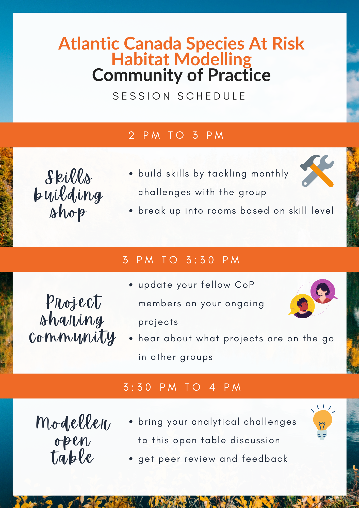

## Community of Practice Monthly Meetings

Note: **This is NOT a lecture series!** Our monthly meeting is an evolving format focused on *community building* and connecting people within the group (i.e., our focus is not on presenting content or delivering training like a lecture series might be). 

### Upcoming Meeting Themes

#### September 2022

**Skills Building Shop: **Lionel Leston from the University of Alberta will demonstrate boosted regression trees for Canada Warbler and/or Wood Thrush in Nova Scotia in R. He may surprise us with a demonstration of species distribution models, possibly run in Google Earth Engine!

#### October 2022

TBD.

#### Fall 2022

Tentative format

